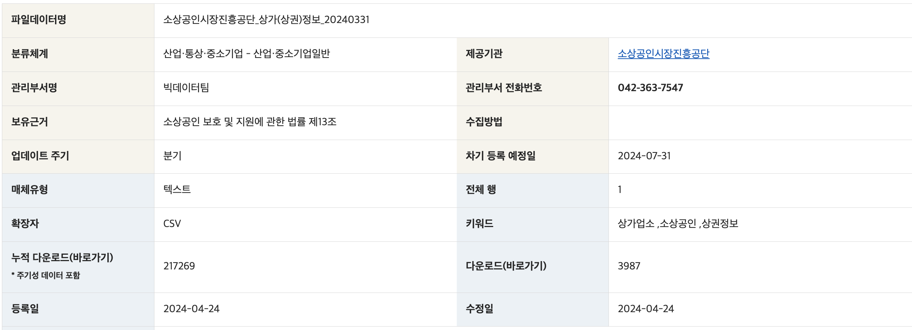

## 목적

아침이나 밤 등 원하는 시간대에 근처의 열려있는 카페를 찾기 위함

### 순서

1. 데이터 수집
    - 출처: https://www.data.go.kr/data/15083033/fileData.do
    - 소상공인시장진흥공단_상가(상권)정보
    - 
    - 업데이트 주기: 분기
    - 마지막 수정일: 2024-04-24
    - encoding: utf-8
    - data size: (475236, 39)
    - memory usage: 141.4+ MB

2. 데이터 정제
    1. 데이터 확인
    2. 불필요한 컬럼 제거: (475236, 39) -> (475145, 10)
        - 상호명
        - 지점명
        - 상권업종소분류명: 업종 선택을 위함 -> 표쥰산업분류명로만 부족 -> 카페
        - 표쥰산업분류명: 업종 선택을 위함 -> 커피 전문점 (+ 결측치 있는 행 제거)
        - 행정동 
        - 법정동
        - 지번주소
        - 도로명주소
        - 경도
        - 위도 
    3. 업종 선택(카페): (475145, 10) -> (21425, 10)
        - 상권업종소분류명 -> 카페
        - 표쥰산업분류명 -> 커피 전문점
    4. 지역 좁히기(크롤링 시간이 너무 오래걸림): 서울(21425, 10) -> 종로1234가동(364, 10)
        - 행정동명이 종로1234가동 인 경우만 선택 (`py.dong`)

3. 크롤링
    1. 카카오맵에서 해당 업장 검색한 링크 얻어와서 url 컬럼 추가(`py.crawling.get_url`)
    2. 해당 링크안의 영업시간 정보 크롤링 (`py.crawling.newtab_parse`)
    3. 영업시간 정보 컬럼 추가(raw)

4. 영업시간 텍스트 정보 정제

```python
## 입력할 값
search_date = ['2024','07','05']
search_time = '24:00'

## 
week = ['월','화','수','목','금','토','일']
week_obj = {'월': 0, '화': 1, '수': 2, '목': 3, '금': 4, '토': 5, '일': 6}
basic_sche_ls = [False, False, False, False, False, False, False]

## 기능
get_holiday_ls(search_year) # 공휴일 리스트 불러오는 함수
holiday_list = get_holiday_ls(search_date[0])
is_holiday(holiday_list, search_date) # 공휴일인지 확인하는 함수
get_operating_time_dict(op_info_list) # 영업정보 dictionary 리턴하는 함수 
get_sche_ls(op_ls) # 영업스케줄 list 리턴하는 함수
check_cafe_sche(operating_hours, search_time) # 영업시간 범위 확인하는 함수
cafe_go(op_info_list, search_date, search_time) # 카페이용 가능한지 확인하는 함수
hecked_cafe_df(dataframe) # 데이터에서 이용가능한 카페리스트 반환하는 함수

# csv 불러와서 편집
df = pd.read_csv('drop_nulls.csv', converters={"운영시간":literal_eval, "운영시간":literal_eval})
checked_cafe_df(df)
```
    
5. 최종 테이블에서 검색결과 출력
    - input: 위도, 경도, 반경, 운영시간
    - output: 기준접으로부터 정해진 거리까지의 카페를 가까운 순으로 정렬하여 출력 
        - out_csv columns : 상호명, 거리, 링크, 주소, 운영시간

6. 지도 api를 통해 위도, 경도를 쉽게 받아오는 방법 고민