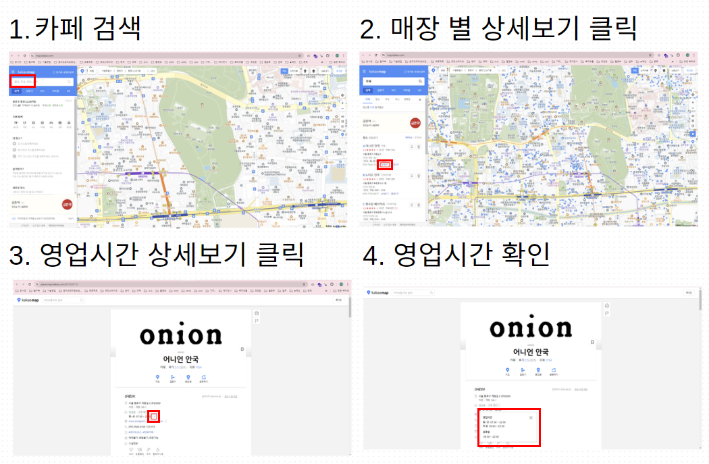
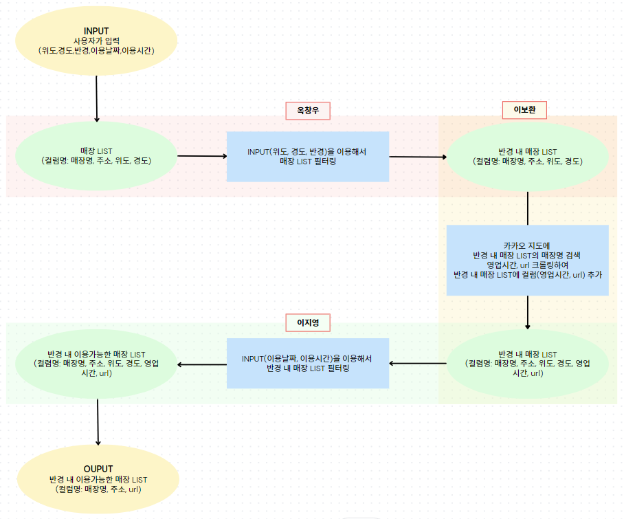
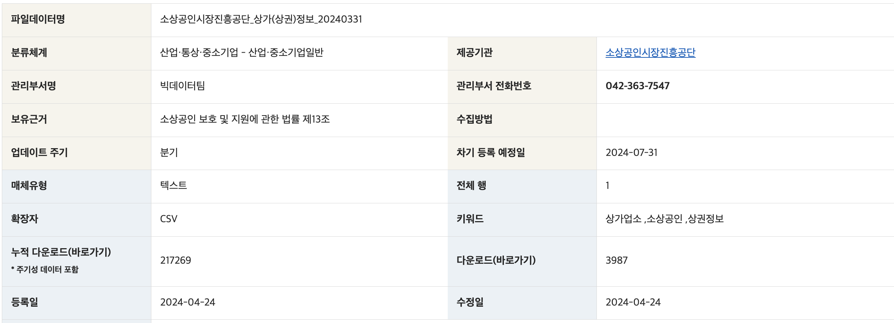
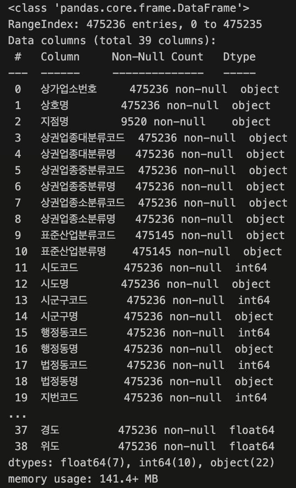
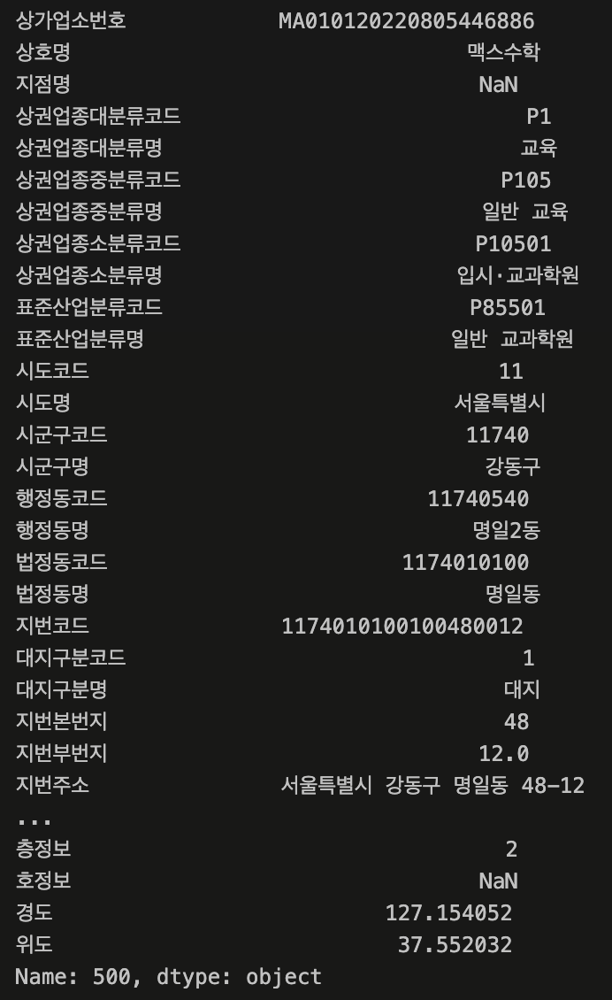
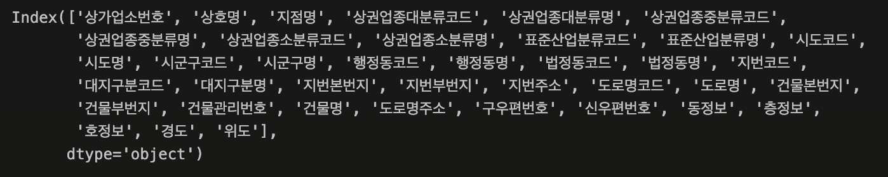
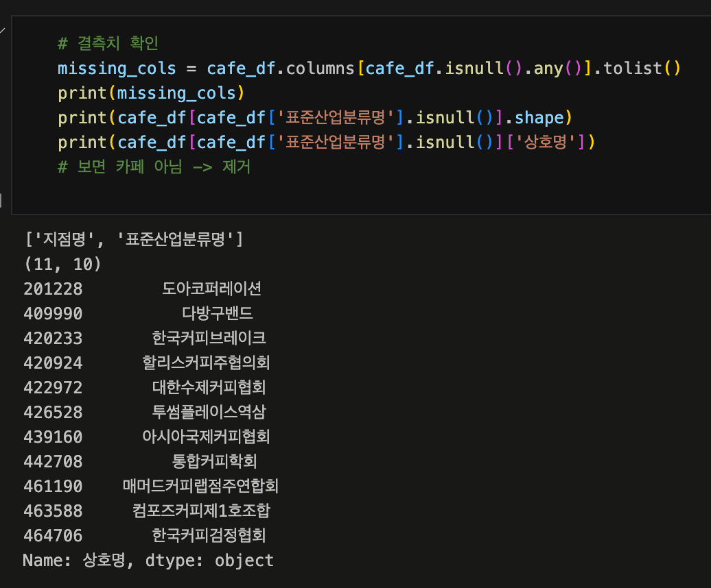
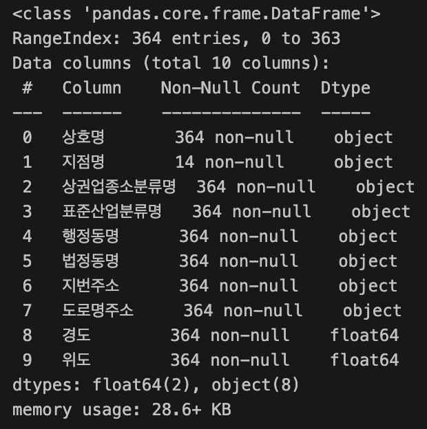
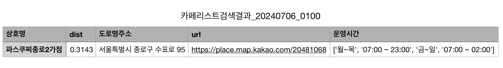

# 원하는 시간과 장소로 영업중인 카페 탐색
---

< 프로젝트 목적 : 원하는 시간대에 근처의 열려있는 카페를 찾기 위함 >

- 카카오 지도를 크롤링하여 목적에 따른 필터링 작업 진행

- 프로젝트 진행 과정

  - 주제선정 > 자료수집 > 계획 세우기 > 구현 및 코드 정리 > 회고

## 1. 주제 선정 :

### (1) 주제 선정 이유

: 평소 지도 앱을 이용하면서 불편함을 느꼈던 기능을 해결해보고자 주제를 선정하게 되었다.

- 불편한 점 : "특정 시간에 사용가능한 장소"를 찾으려할때 각 장소들의 영업시간을 확인하기 위해
각 장소마다 상세보기를 클릭한 뒤 영업시간을 클릭해서 확인해야하는 것이 불편했다.



- 개선할 점 : 불필요한 단계를 줄인다.
-> "장소(위도, 경도)", "반경", "이용날짜", "이용시간"을 입력하면 이용가능한 장소들의 리스트를 반환한다.

### (2) 주제 활용 예시

 : 약속장소를 정하거나, 여행계획을 세울 때 특정시간에 이용가능한 장소를 빠르게 찾을 수 있다.

## 2. 자료수집 :

### (1) 매장 정보 데이터를 받기 데이터 포털 사용

- 데이터량이 많고 업데이트가 자주 있는 데이터가 아니므로 다운받아서 사용하기로 함.
-> 매장의 위도, 경도 데이터를 받아옴

### (2) 카카오 지도 크롤링 :

- 카페명을 검색해서 영업시간을 크롤링.
    - -> 매장 영업시간 정보를 확인하기위해서 여러번 클릭해서 찾아가야하므로 셀레니움 이용해서 크롤링함.
    
    > **정적페이지 / 동적페이지 차이** 
    
    정적 페이지는 인터넷에 접속하면 페이지의 모든 정보가 업로드 된다. 아무런 추가 작업 없이 html을 불러오면 그 안에 모든 데이터를 추출할 수 있다.
    
    반면, 동적 페이지는 페이지 내에서 사용자가 특정한 동작을 해야만 추가적인 정보가 업데이트 된다.
    클릭, 스크롤, 로그인 등의 동작을 말한다. 원하는 정보를 얻기 위해 특정한 동작을 해야만 html에 해당 데이터가 갱신되는 것이다.
    
    출처: [https://charimlab.tistory.com/entry/ep01웹크롤링-11-동적-페이지웹-동작-자동화Selenium-with-파이썬](https://charimlab.tistory.com/entry/ep01%EC%9B%B9%ED%81%AC%EB%A1%A4%EB%A7%81-11-%EB%8F%99%EC%A0%81-%ED%8E%98%EC%9D%B4%EC%A7%80%EC%9B%B9-%EB%8F%99%EC%9E%91-%EC%9E%90%EB%8F%99%ED%99%94Selenium-with-%ED%8C%8C%EC%9D%B4%EC%8D%AC) [챠마랩: 챠림의 마케팅 연구소:티스토리]
    > 

## 3. 계획



1. 데이터 준비
    
    (1) 데이터 수집
    
    (2) 데이터 확인
    
    (3) 데이터 정리
    
    (4) 데이터 정리 결과 확인
    
2. 크롤링
    
    (1) 카카오 맵에서 매장 검색
    
    (2) 검색 결과 url을 가져와서 url컬럼 추가
    
    (3) 해당 url의 영업시간 정보 크롤링, 컬럼 추가
    
    (4) 결측치 제거: 검색결과가 없거나, 영업시간 정보가 없는 경우
    
3. 입력 정보에 따라 필터링
    
    (1) 영업시간 정보 정제
    
    (2) 입력 정보 필터링
    
    (3) 결과 확인
    

### 1) 데이터 준비

### 1-1) 데이터 수집


- 해당 페이지에서 csv파일을 다운로드하여 사용



```markdown
    - 출처: https://www.data.go.kr/data/15083033/fileData.do
    - 소상공인시장진흥공단_상가(상권)정보
    - 
    - 업데이트 주기: 분기
    - 마지막 수정일: 2024-04-24
    - encoding: utf-8
    - data size: (475236, 39)
    - memory usage: 141.4+ MB
    - 데이터 크기: 259.2 MB
```

### 1-2)  데이터 확인

1. 원본 데이터 확인: `notebook/data_load.ipynb`








- 필요하지 않은 데이터가 많음
- 데이터를 가져오는데 오래걸림
- 이 모든 데이터에 대해서 크롤링하기엔 시간이 너무 오래걸림
    
    → 정리 필요
    

### 1-3)  데이터 정리


- `notebook/data_load.ipynb` : 분석
- `py/data_load.py` : 실행

**1) 사용할 컬럼 선택:** 

- 메인 컬럼
    - **상호명** : 검색 키워드 (1)
    - **상권업종소분류명** : 업종 필터링 (1) ( → 카페 )
    - **표쥰산업분류명** : 업종 필터링 (2) ( → 커피 전문점 )
    - **행정동** : 검색 키워드 (2)
    - **도로명주소** : 출력
    - **경도** : 위치정보 전달
    - **위도** : 위치정보 전달
- 옵션 컬럼
    - 지점명 : 프랜차이즈 등 중복결과가 있을 경우 검색 키워드에 추가
    - 법정동 : 행정동보다 넓은 범위
    - 지번주소 : 도로명주소 말고 지번주소가 필요한 경우

**2) 업종 선택** 

- 원본 데이터에는 등록된 모든 상권 정보가 들어 있음. 필요한건 카페 정보
- 카페 정보만 가져와서 저장

**3) 결측치 제거**



- 업종 정보를 필터링 했을 때 그 정보에 결측치가 있는 경우 실제 카페가 아닌 경우가 있음 → 제거해 줌

**4) 지역 좁히기**

- 크롤링 할 때 시간이 오래걸려서 일단 빠르게 구현할 수 있도록 특정 범위로 줄여줌
- ‘행정동명’ 으로 필터링


### 1-4)  **데이터 정리 결과**



- 데이터 크기를 `259.2 MB (475145, 10)` → `71 KB (364, 10)` 로 줄임

```markdown
1. `original_data.csv`      : (475236, 39) 원본 데이터 
2. `cafe_seoul.csv`         : (21425, 10)  컬럼제거하고 카페만 가져온 데이터 
3. `cafe_jongro.csv`        : (364, 10)    종로1234가동으로 필터링 
4. `cafe_jongro_url.csv`    : (364, 11)    3번에 url만 크롤링해온 데이터 
5. `cafe_jongro_crawled.csv`: (301, 12)    4번에 운영시간 크롤링 + 결측치 제거 
6. `cafe_jongro_sorted.csv` : (104, 13)    5번을 거리기준으로 필터링, 거리정보 컬럼추가, 가까운순으로 정렬 
```

### 2) 크롤링

- 셀레니움 사용
- url, 영업시간 크롤링
    
    (1) 카카오 맵에서 매장 검색
    
    (2) 검색 결과 url을 가져와서 url컬럼 추가
    
    (3) 해당 url의 영업시간 정보 크롤링, 컬럼 추가
    
    (4) 결측치 제거: 검색결과가 없거나, 영업시간 정보가 없는 경우
    


### 3) 입력 정보에 따라 필터링

(1) 영업시간 정보 정제

(2) 입력 정보 필터링

(3) 결과 확인

## 4. 구현 및 코드 정리 : 사용 기술 및 코드에 대한 설명

- 데이터 정리


- 셀레니움(카카오 지도 크롤링)
    
    ```python
    # crawling.py
    # 크롤링 정보를 저장하는 모듈
    from selenium.webdriver.common.by import By
    from selenium.webdriver.common.keys import Keys
    from bs4 import BeautifulSoup
    from selenium import webdriver
    import time
    import gc
    import pandas as pd
    import os
    
    # 1. crawl_url(cafe): 키워드로 검색해서 해당 매장 정보페이지 url 반환
    def crawl_url(cafe):
        '''
        input
            cafe: str, 도로명주소 + 상호명
        return
            new_tab_url: str, 카카오맵 매장 페이지 url
        '''
        ...
        return new_tab_url
        
    # 2. crawl_time(url): 받은 url에서 운영시간 정보 받아옴. 리스트로 반환
    def crawl_time(url):
        '''
        input
            url: str, 카카오맵 매장 페이지 url
        return
            all_text: list, 운영시간 정보(text)를 담은 리스트 객체 반환
        '''
        ...
        return all_text
        
    # 3. crawl_star(url): 받은 url에서 별점정보 문자열로 반환
    def crawl_star(url):
        ''' 
        input: str, url
        return: str, 평점
        '''
        ...
        return star
    
    # 4. case_test(case, ifprint=False): 출력 테스트
    def case_test(case, ifprint=False):
    	  ...
        return case_txt
        
    # 5. url을 가져옴
    def get_urls(data_path, getcsv=False): #, save_path):
        '''
        args
            data_path: csv 파일
            save_path: 저장 경로(확장자 포함)
        '''
        df = pd.read_csv(data_path)
        df_length = df.index[-1]+1
    
        url_ls = []
        for i in range(df_length):
        # for i in range(5):
            print(f'\n## get urls({i+1}/{df_length})...')
            url = crawl_url(df['행정동명'][i] + ' ' + df['상호명'][i])
            url_ls.append(url)
            print(f"{i} : {df['상호명'][i]}, {url}")
        print(len(url_ls))
    
        df['url'] = url_ls
        if getcsv:
           save_path = data_path.replace('.csv', '_withURL.csv')
           df.to_csv(save_path, index=False, encoding='utf-8-sig')
        return df
        
    # 6. 시간정보 얻고 결측치 제거
    def get_time_n_dropna(df, save_path):
        '''
        args
            df: DataFrame,
                get_urls로 구한 df
                (또는 url컬럼이 포함된 csv 파일:data)
                    #df = pd.read_csv(data)  
    
                -> save csv file
            save_path: str, csv file save path (with extension)
        '''
        # url 없으면 에러 -> 결측치 제거
        df.dropna(subset=['url'], inplace=True)
        df.reset_index(drop=True, inplace=True)
    
        # get time
        df_length = df.index[-1]+1
        time_ls = []
        for i in range(df_length):
            print(f'\n## get time({i+1}/{df_length})...')
            time = crawl_time(df['url'][i])
            time_ls.append(time)
            print(f"{i+1} : {df['상호명'][i]}, {time}")
            
        # 운영시간 없는 경우 데이터 제거
        df['운영시간'] = time_ls
        df.dropna(subset=['운영시간'], inplace=True)
        df.reset_index(drop=True, inplace=True)
    
        # save csv file
        df.to_csv(save_path, index=False, encoding='utf-8-sig')
        
    ```
    
    ```python
    # crawl.py 
    # 2. 크롤링 실행 모듈
    # -------------------------------------------------------------------------
    # data_load.py로부터 만들어진 csv사용
    # 크롤링해서 데이터에 url, time컬럼 추가 =====> 시간 오래걸림(에러나면 한줄씩 try해서 실패하면 다시하는걸로)
    # 시간이 오래걸리니 중간 에러를 대비해서 나눠서 처리, 저장
    # ~~~URL.csv, 
    # ~~~_crawled.csv
    
    from py import crawling
    import pandas as pd
    import os
    
    # data: cafe_jongro.csv 가져와서 아래 크롤링 실행 
    # data_path = 'data/cafe_jongro.csv' # 상대경로
    
    # 데이터 저장 경로
    data_dir = '/Users/okchang/mainbiz/project/p1_final/data'
    filename = 'cafe_jongro'
    
    data_path = os.path.join(data_dir, f'{filename}.csv') # 정리만 된 data
    
    # test = '_test'
    test = ''
    
    ## 1) url 컬럼 추가, 저장
    df_url = crawling.get_urls(data_path)
    df_url.to_csv(os.path.join(data_dir, f'{filename}_url{test}.csv'), index=False, encoding='utf-8-sig')
    print('1) URL 크롤링 완료!!!!!!!!!!!!!!')
    
    ## 2) 운영시간 컬럼 추가, 저장
    loaded_df_url = pd.read_csv(os.path.join(data_dir, f'{filename}_url{test}.csv')) # url포함해서 저장된 csv파일 load
    
    save_path = os.path.join(data_dir, f'{filename}_crawled{test}.csv') # 크롤링 포함된 data 저장
    crawling.get_time_n_dropna(loaded_df_url, save_path) # save csv
    print('2) 운영시간 크롤링 + 결측치 제거 완료')
    ```
    
- 반경식으로 데이터 필터링
    
    ```python
    # distance.py
    # 기준 좌표로 거리 구해서 정렬해주는 모듈
    import pandas as pd
    from haversine import haversine # 좌표정보로 거리 구할 수 있는 라이브러리
    
    def distance(data, latitude, longitude, radius):
        '''
        args
            data: str, data.csv 경로 (위도 경도 포함된)
            latitude: float, 기준점 위도
            longitude: float, 기준점 경도
            radius: float, 기준점으로부터의 거리 km 
        
        return
            : 기준점으로부터의 거리 정보가 포함된 dataframe
        '''
        df = pd.read_csv(data)
    
        cafe_ls = []
        dist_ls = []
        
        # 기준점과 데이터상 카페와의 거리 구하기
        for i in range(len(df)):
            # x, y: 카페의 위도, 경도
            x = df['위도'][i]
            y = df['경도'][i]
            # haversine() : 두 지점의 거리 반환
            dist = haversine((latitude, longitude), (x, y), unit = 'km')
            # 입력된 반경 이내의 카페를 리스트에 담고 df로 만듦
            if dist < radius:  
                cafe_ls.append(df.iloc[i]) # 전체 행이 담긴 리스트
                dist_ls.append(dist) # 기준점과의 거리만 담긴 리스트
    
        dist_df = pd.DataFrame(cafe_ls)
    
        # dist_df에 dist컬럼 추가
        dist_df['dist'] = dist_ls
        dist_df['dist'] = dist_df['dist'].round(4)
    
        # dist컬럼 오름차순 정렬
        sorted_df = dist_df.sort_values(by='dist', ascending=True)
    
        # 인덱스 초기화
        reidx_df = sorted_df.reset_index(drop=True, inplace=False)
    
        return reidx_df
    ```
    
    ```python
    # sort_distance.py
    # -------------------------------------------------------------------------
    # : 거리별 필터링, 정리
    # 위치정보 입력값 받음
    # 여기서 저장된 dataframe으로 운영시간 정리 + 해당 시간에 열려있는 카페 최종 결과 출력
    import pandas as pd
    import os
    from py import distance
    import sys
    
    ## INPUTS (sample: kg아이티뱅크) =========================================
    latitude = 37.571006515132865
    longitude = 126.99251768504305
    radius = 0.5 # km
    
    # latitude = float(sys.argv[1])
    # longitude = float(sys.argv[2])
    # radius = float(sys.argv[3])
    ## =====================================================================
    
    data_dir = '/Users/okchang/mainbiz/project/p1_final/data'
    filename = 'cafe_jongro'
    
    crawled_df_path = os.path.join(data_dir, f'{filename}_crawled.csv')
    sorted_df = distance.distance(crawled_df_path, latitude, longitude, radius)
    # sorted_df.info()
    
    sorted_df.to_csv(os.path.join(data_dir, f'{filename}_sorted.csv'), index=False, encoding='utf-8-sig')
    print('done!')
    ```
    

- 날짜, 시간 필터링 코드 설명
    
    ```python
    ## 코드 설명 ::
    
    # 매장List csv에서 '운영시간' 컬럼 값(= op_info_list)을 필터링에 이용하기 위해 
    # 영업정보 dictionary 형태로 정리하는 함수이다.
    # '운영시간' 값(= op_info_list)이 제각각 인데, 큰틀에서는 ['(영업시간)', '휴무일', '(휴무요일)', '공휴일', '(공휴일영업시간)']에 대한 정보로 볼 수 있다.
    # '운영시간' 값(= op_info_list)을 이용하기 쉬운형태인 {'영업일' : [요일, 영업시간 list], '휴무일' : [휴무요일 list], '공휴일' : [공휴일의 영업시간] } 로 dictionary를 정리했다.
    # '휴무일'과 '공휴일'은 랜덤하게 포함되어 있어서 op_info_list에 포함되어 있는 경우 아닌 경우로 나누어 if문을 정리했다.
    # 예외 상황들에 대해서 값을 확인해가면서 필요한 코드를 추가해주었다.
    
    # 영업정보 dictionary 리턴하는 함수 
    
    # op_info_list : ['월', '07:00 ~ 22:00', '수~금', '07:00 ~ 23:00', '일', '09:00 ~ 23:00', '휴무일', '화, 목', '공휴일', '09:00 ~ 22:00']
    # return : {'영업일': ['07:00 ~ 22:00', False, '07:00 ~ 23:00', '07:00 ~ 23:00', '07:00 ~ 23:00', False, '09:00 ~ 23:00'], '휴무일': ['화', '토'], '공휴일': ['09:00 ~ 22:00']}
    def get_operating_time_dict(op_info_list):
        if '휴무일' in op_info_list and '공휴일' in op_info_list:
            cday = op_info_list.index('휴무일')
            hday = op_info_list.index('공휴일')
            if len(op_info_list) == hday+1:
                obj = {'영업일': op_info_list[:cday], '휴무일': op_info_list[cday+1 :hday], '공휴일':['휴무일'] }
                return obj
            else:
                if cday < hday: 
                    obj = {'영업일': op_info_list[:cday], '휴무일': op_info_list[cday+1 :hday], '공휴일': op_info_list[hday+1:] }
                    return obj
                if hday < cday:
                    obj = {'영업일': op_info_list[:hday], '공휴일': op_info_list[hday+1 :cday], '휴무일': op_info_list[cday+1:] }
                    return obj
        elif '휴무일' in op_info_list:
            cday = op_info_list.index('휴무일')
            obj = {'영업일': op_info_list[:cday], '휴무일': op_info_list[cday+1 :]}
            return obj
        elif '공휴일' in op_info_list:
            hday = op_info_list.index('공휴일')
            if len(op_info_list) == hday+1:
                obj = {'영업일': op_info_list[:hday], '공휴일':'휴무일' }
                return obj
            else: 
                obj = {'영업일': op_info_list[:hday], '공휴일': op_info_list[hday+1 :]}
                return obj
        else:
            obj = {'영업일': op_info_list}
            return obj
    ```
    
    ```python
    ## 코드 설명 ::
    # 영업정보 dictionary의 '영업일'의 값을 [월요일 영업시간, 화요일 영업시간, 수요일 영업시간, 목요일 영업시간 , 금요일 영업시간, 토요일 영업시간, 일요일 영업시간]의 값으로 정리하는 함수
    # 휴무일(= 영업시간이 없는날)은 False 값을 넣어줌.
    # op_ls 값은 [영업요일, 영업시간, .. 영업요일, 영업시간] 형태이므로 짝수 index를 요일, index+1값을 시간으로 정리했다.
    # '월화수목금토일~,' 외의 값이 있는 경우 불필요한 정보로 간주하고 제외시켰다. (예. 라스트오더 시간)
    
    # 영업스케줄 list 리턴하는 함수
    # op_ls: ['월~목', '07:00 ~ 22:00', '일', '09:00 ~ 23:00']
    # return: ['07:00 ~ 22:00', '07:00 ~ 22:00', '07:00 ~ 22:00', '07:00 ~ 22:00', False, False, '09:00 ~ 23:00']
    def get_sche_ls(op_ls):
        result = basic_sche_ls.copy()
        com=re.compile('[^월화수목금토일~,]')
        
        for idx in range(len(op_ls)):
            if idx % 2 == 0 :
                if '매일' == op_ls[idx]:
                    for i in range(6):
                        result[i] = op_ls[idx+1]
                            
                elif len(com.findall(op_ls[idx])) == 0:
                    if'~' in op_ls[idx]:
                        sd = op_ls[idx].split('~')[0]
                        fd = op_ls[idx].split('~')[1]
                    
                        for i in range(week_obj[fd]+1):
                            if i >= week_obj[sd]: 
                                result[i] = op_ls[idx+1]
                    
                    elif ',' in op_ls[idx] : 
                        day_ls = op_ls[idx].split(',')
                        for day in day_ls:
                            result[week_obj[day]] = op_ls[idx+1]
    
        return result 
    ```
    
    ```python
    ## 코드 설명 ::
    # INPUT 이용날짜와 이용시간에 따라 이용가능한 카페를 필터링해주었다. 
    # 이때, 이용시간 해당 요일 영업시간이 아닌 전요일 영업시간에 해당하는 경우가 있었다.
    # 예) 영업시간: 수: 05:00 ~ 26:00(새벽2시), 목: 05:00 ~ 12:00, / 이용시간: 목요일 02:00(= 수: 26:00) 
    # 따라서 2가지 경우에 대해 운영을 확인하여 or 연산한 값을 '운영확인' 값으로 넣어주었다.
    
    # 데이터에서 이용가능한 카페리스트 반환하는 함수
    # dataframe : 카페csv파일 불러온 것 -> cafe_jongro_crawled.csv
    # result_path : 파일 저장할 경로
    # search_date : INPUT DATA(이용 날짜)
    # search_time : INPUT DATA(이용 시간)
    # return : 이용가능한 카페리스트 (dataframe)
    def checked_cafe_df(dataframe, result_path, search_date, search_time):        ##### 추가 ##### + result_path
        result = []
        result1 = []
        result2 = []
    
        ## search_time이 전날의 closetime 전일 수 있으므로 확인하기 위한 코드 
        # 예시 : 
        # search_time : 7/6 02:00 --> 7/5 26:00
        # 운영시간 : 7/5 12:00 ~ 03:00(27:00), 7/6 12:00 ~ 03:00(27:00)
        date2 = datetime.datetime.strftime(datetime.datetime.strptime(''.join(search_date), '%Y%m%d') + datetime.timedelta(days=-1), '%Y%m%d')
        search_date2 = [date2[:4], date2[4:6], date2[6:]]
        search_time2 = f"{int(search_time.split(':')[0])+24}:{search_time.split(':')[1]}"
        
        for op_info_list in dataframe['운영시간'].values.tolist():
            value = cafe_go(op_info_list, search_date, search_time) or cafe_go(op_info_list, search_date2, search_time2)
            result.append(value)
            result1.append(cafe_go(op_info_list, search_date, search_time))
            result2.append(cafe_go(op_info_list, search_date2, search_time2))
       
        dataframe['운영확인'] = result
        dataframe['운영확인1'] = result1
        dataframe['운영확인2'] = result2
        
        new_df = dataframe.loc[dataframe['운영확인'], ['상호명', 'dist', '도로명주소', 'url', '운영시간']] #, '운영확인1', '운영확인2', '운영확인']]
        date = ''.join(search_date)
        time = ''.join(search_time.split(':'))
        
        # 저장경로 추가                                                              ##### 추가 #####
        filename = f'카페리스트검색결과_{date}_{time}.csv'
        save_path = os.path.join(result_path, filename)
    
        pd.DataFrame(new_df).to_csv(save_path, index=False, encoding='utf-8-sig') ##### 수정 #####
        
        # 확인을 위한 return추가
        return new_df
    ```
    

### 결과 csv:  오전 01:00



## 5. 프로젝트 회고 (아쉬운점, 개선하고 싶은 점, 느낀점 등등..)

- 옥창우 : 데이터베이스를 잘 알았으면 쿼리날려서 쉽게 진행할 수 있었을텐데 아쉽다.. 웹개발도 조금만 알았으면 웹으로 편하게 구현했을텐데….
- 이보환 : 많은 양을 크롤링하게될때 시간이 오래걸렸고 생각하던 것을 코드로 빠르게 만들기 위해 좀 더 분발해서 공부해야할 것 같다.
- 이지영 : 정제되지 않은 데이터를 필터링 할 때 어려움을 느꼈다. (영업시간이 큰 틀은 비슷했지만, 상세적으로는 제각각 쓰여있었음.)
데이터를 목적에 맞게 깔끔하게 정리하는 방법에 대해 관심을 가지게 되었다. 현재는 카페 항목에 대해서만 적용되었지만, 영업시간에 대한 크롤링 시간을 단축할 방안을 찾는다면 식당, 기타 항목에도 적용할 수 있게 더 넓은 범위로 확장해보고 싶다.
